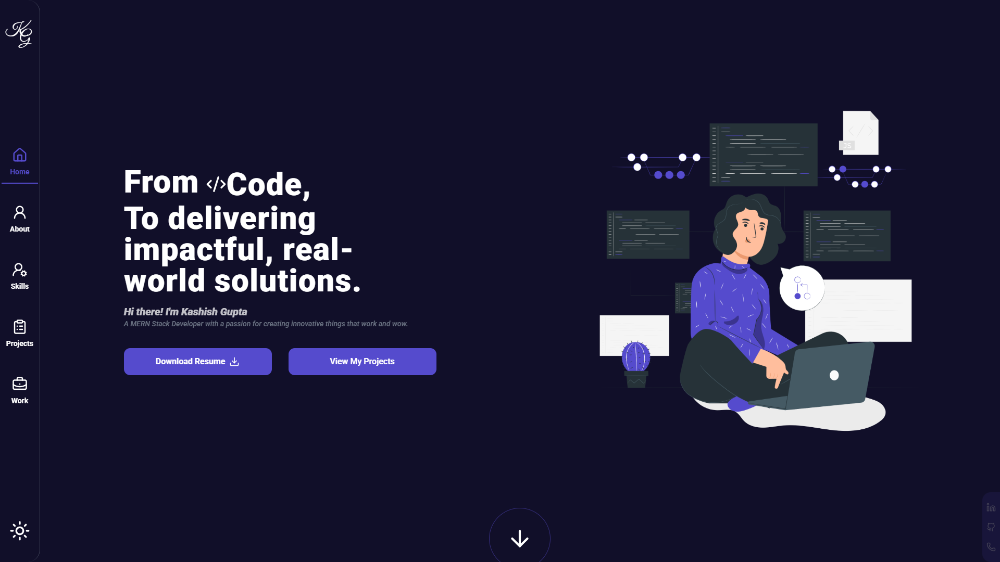

# 🌐 My Portfolio Website  

[](https://react.dev/)  [](https://vitejs.dev/)  [](https://tailwindcss.com/)  [](https://www.framer.com/motion/)  [](https://www.netlify.com/)[](https://vercel.com/)  

A modern, responsive personal portfolio built with **React + Tailwind CSS** to showcase my skills, projects, and resume.  

 

---

## ✨ Features  
- ⚡ **Modern UI/UX** with animations and dark mode  
- 📂 **Projects Showcase** with 3D tilt effects  
- 🧑‍💻 **About Section** – professional summary and skillset  
- 🛠️ **Skills Section** – interactive categorized skills display  
- 📄 **Resume Download** – one-click access to my CV  
- 🎭 **Scroll Reveal Animations** for smooth user experience  
- 🌍 Fully **responsive** across devices  

---

## 🛠️ Tech Stack  
- **Frontend:** React, Vite  
- **Styling:** Tailwind CSS, Lucide Icons  
- **Animations:** Framer Motion, ScrollReveal  
- **Deployment:** Vercel

---

## 🚀 Getting Started  

### 1️⃣ Clone the Repository  
```bash
git clone https://github.com/kashishgupta2402/portfolio.git
cd portfolio
```

### 2️⃣ Install Dependencies
```bash
npm install
```

### 3️⃣ Run the Development Server
```bash
npm run dev
```


### 4️⃣ Build for Production
```bash
npm run build

```

---

## 📂 Project Structure
```bash
portfolio/
 ├── public/              # Static assets (resume, images, etc.)
 ├── src/
 │   ├── components/       # Reusable UI components
 │   ├── constants/        # Project & skill data
 │   ├── pages/            # Sections (About, Skills, Projects, Contact)
 │   ├── App.jsx           # Main app entry
 │   └── main.jsx          # React DOM entry
 └── README.md
```

---
## 📄 Resume
[Download Resume](./public/Kashish-Gupta-Resume.pdf)

---
## 🚀 Deployment

This portfolio is deployed on:
- 🌐 [Vercel](https://portfolio-nu-five-w6ffxlvy46.vercel.app/) 


---
## 📬 Contact

### 👤 Kashish Gupta
📧 Email: kashishgupta2402@gmail.com

💼 LinkedIn: www.linkedin.com/in/kashish-gupta-32a0431b0

🐙 GitHub: https://github.com/Kashish2402/

---

⭐ If you like this portfolio, consider giving it a star on GitHub!
